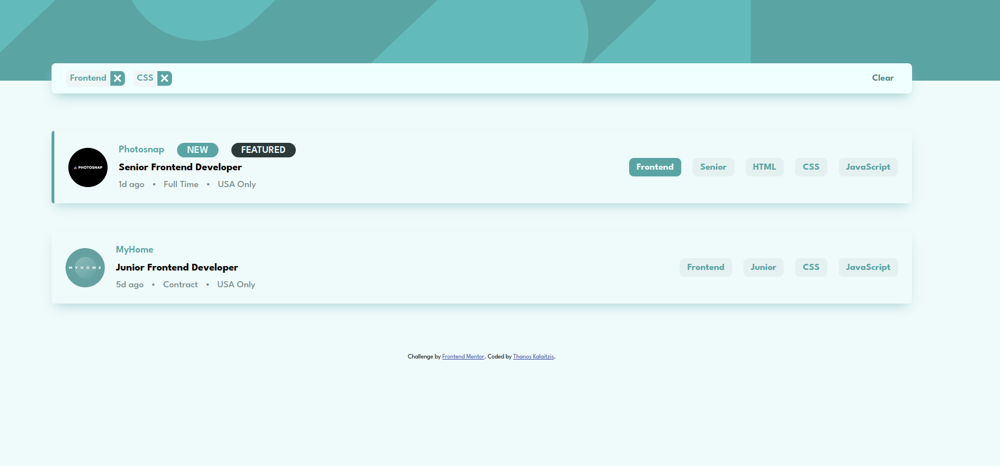
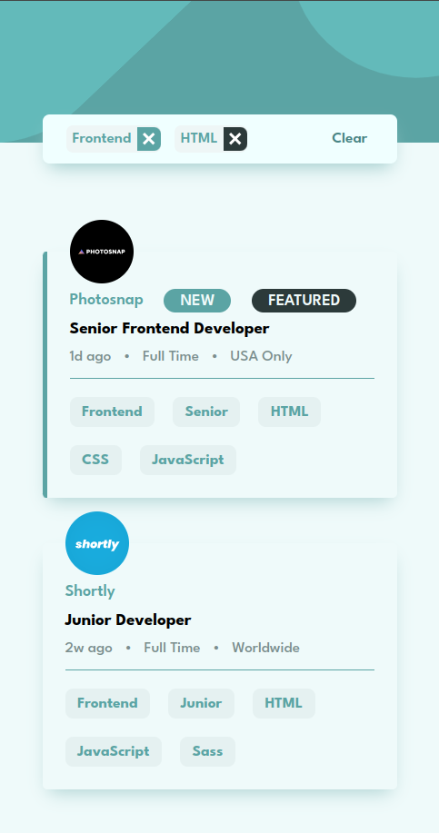

# Frontend Mentor - Job listings with filtering solution

This is a solution to the [Job listings with filtering challenge on Frontend Mentor](https://www.frontendmentor.io/challenges/job-listings-with-filtering-ivstIPCt).

## Overview

### The challenge

Users are able to:

- View the optimal layout for the site depending on their device's screen size
- See hover states for all interactive elements on the page
- Filter job listings based on the categories

### Screenshot

,
,

### Links

- [Solution URL Github](https://github.com/Thanos-M11/angular-job-listing/tree/with-rxjs)
- [Live Site URL](https://thanos-m11.github.io/job-listing-typescript/)

## My process

### (3) services:

- `filterService`
- `jobService`
- `buttonService`

### (1) observable

- a `filter$` observable

### (1) subscriber

- a `filterService` subscriber to the `filter$` observable to pass both the `currentFilter` and the `currentJobs` to its children.
